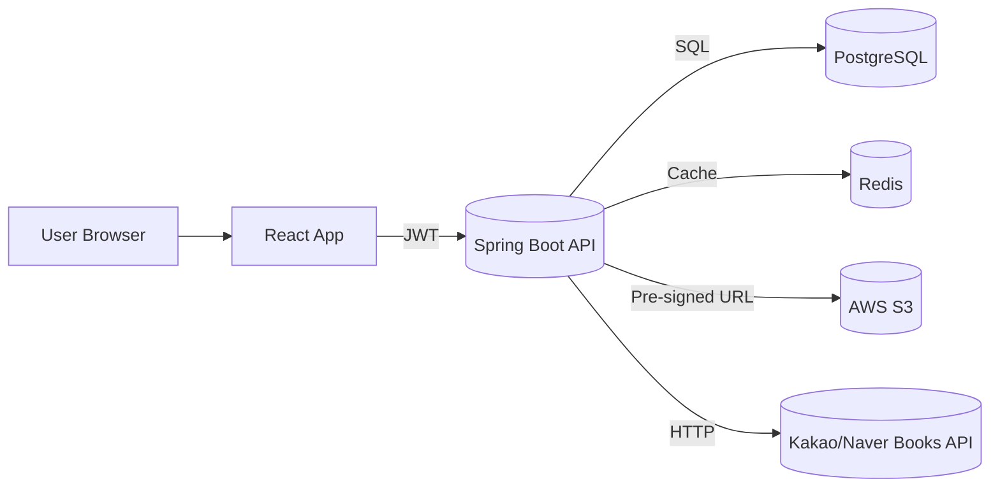

# 📐 Architecture: 개인기록 중심 독서 기록 앱 (BookNote)

## 1) 기술 스택 개요
### Frontend
- **Framework**: React 18 + Vite
- **Styling**: Tailwind CSS (선택: DaisyUI)
- **Data/State**: TanStack Query, React Hook Form + Zod
- **Visualization**: Recharts
- **Routing**: TanStack Router
- **Auth**: JWT 저장/갱신 로직, 인터셉터, Protected Route

### Backend
- **Framework**: Spring Boot 3 (Java 21)
- **Security**: Spring Security + JWT (Access/Refresh)
- **Persistence**: Spring Data JPA + PostgreSQL
- **Migration**: Flyway
- **Cache**: Redis
- **Storage**: AWS S3 (커버 이미지, CSV/JSON 파일)
- **Docs**: springdoc-openapi (Swagger UI)
- **Observability**: Actuator + Prometheus + Grafana

### Infra/CI-CD
- **Build**: Gradle
- **Container**: Docker
- **CI/CD**: GitHub Actions (테스트 → 빌드 → 컨테이너 → 배포)
- **Deploy**: (선택) Kubernetes + Helm/ArgoCD
- **Release**: Blue/Green 또는 Rolling

---

## 2) 아키텍처 개요
사용자 경험은 프런트엔드(React)에서 시작하며, 외부 도서 검색은 **클라이언트 → 백엔드(프록시) → Kakao/Naver** 흐름으로 호출합니다. 백엔드에서 결과를 **Redis** 캐시에 저장하고, 정규화된 서지 정보는 **PostgreSQL**에 적재합니다. 파일 업로드/다운로드는 **S3 Pre-signed URL**로 처리합니다.



---

## 3) 주요 모듈
### Frontend 모듈
- **Auth**: 로그인/회원가입, 토큰 저장/갱신, 401 핸들러
- **Search**: 도서 검색 UI, 무한 스크롤, 최근 검색어
- **Library**: 목록/그리드, 정렬·필터, 상세 뷰
- **Record Editor**: 평점/상태/날짜/태그/메모 입력
- **Stats**: 월별/장르별/평점 추이 그래프
- **Backup**: CSV/JSON 내보내기·가져오기

### Backend 모듈
- **Auth Service**: 회원가입/로그인/토큰 재발급
- **Book Service**: 외부 API 호출, 결과 정규화/캐싱, DB 싱크
- **Record Service**: 기록 CRUD, 필터/페이지네이션
- **Stats Service**: 월별/태그별 집계(쿼리 최적화)
- **Import/Export Service**: CSV/JSON 파서, 중복 병합 로직
- **File Service**: S3 Pre-signed URL 발급
- **Security Layer**: JWT 필터, 메서드 보안(@PreAuthorize)

---

## 4) 데이터 모델 (요약)
```sql
-- Users
CREATE TABLE users (
  id BIGSERIAL PRIMARY KEY,
  email VARCHAR(255) UNIQUE NOT NULL,
  password_hash VARCHAR(255) NOT NULL,
  nickname VARCHAR(60) NOT NULL,
  favorite_genres TEXT,
  created_at TIMESTAMPTZ DEFAULT now()
);

-- Books
CREATE TABLE books (
  id BIGSERIAL PRIMARY KEY,
  title VARCHAR(255) NOT NULL,
  author VARCHAR(255),
  publisher VARCHAR(255),
  isbn VARCHAR(20) UNIQUE,
  cover_url TEXT,
  created_at TIMESTAMPTZ DEFAULT now()
);

-- UserBooks
CREATE TABLE user_books (
  id BIGSERIAL PRIMARY KEY,
  user_id BIGINT NOT NULL REFERENCES users(id) ON DELETE CASCADE,
  book_id BIGINT REFERENCES books(id),
  rating SMALLINT CHECK (rating BETWEEN 1 AND 5),
  review TEXT,
  tags TEXT,
  read_date DATE,
  created_at TIMESTAMPTZ DEFAULT now()
);

CREATE INDEX idx_books_isbn ON books(isbn);
CREATE INDEX idx_user_books_user_date ON user_books(user_id, read_date DESC);
```

---

## 5) API 설계 (요약)
### 인증
- `POST /api/auth/signup` — 회원가입
- `POST /api/auth/login` — 로그인(Access/Refresh)
- `POST /api/auth/refresh` — 토큰 재발급

### 도서 검색/관리
- `GET /api/books/search?q=...&page=...` — 외부 API 프록시 + 캐시
- `POST /api/books` — 수동 등록
- `GET /api/books/{id}` — 상세 조회

### 독서 기록
- `GET /api/records?from=&to=&tags=&status=&page=` — 목록/필터
- `POST /api/records` — 생성
- `PUT /api/records/{id}` — 수정
- `DELETE /api/records/{id}` — 삭제

### 통계/회고
- `GET /api/stats/monthly?month=YYYY-MM` — 월별 통계
- `GET /api/stats/tags?from=&to=` — 태그 분포

### 백업/복원
- `GET /api/export?format=csv|json` — 내보내기(파일 스트림)
- `POST /api/import` — 가져오기(CSV 업로드)

### 파일
- `POST /api/files/presign` — S3 Pre-signed URL 발급

---

## 6) 보안
- **인증/인가**: Spring Security + JWT (짧은 Access, 긴 Refresh, Rotation)
- **입력 검증**: DTO + Bean Validation, 서버단 추가 검증
- **비밀 관리**: 환경 변수/Secret Manager, Git에 커밋 금지
- **전송 보호**: HTTPS 의무화, HSTS
- **데이터 보호**: PII 최소 수집, 탈퇴 시 즉시 삭제

---

## 7) 성능 & 신뢰성
- **캐싱**: 검색 결과/자주 보는 책 상세를 Redis로 5~30분 캐싱
- **쿼리 최적화**: 필요한 컬럼만 조회, 페이징 커서 전략(추후)
- **백업/복구**: PostgreSQL PITR, S3 버전닝
- **관측성**: Actuator health, 메트릭(exporter), 로깅 상관관계 ID

---

## 8) 로컬 개발 & 배포
- **로컬**: Docker Compose(Postgres, Redis, LocalStack S3), env.sample 제공
- **테스트**: JUnit5, Testcontainers(DB/Redis), REST Assured
- **CI**: PR 시 빌드/테스트, main 머지 시 이미지 푸시
- **CD**: 스테이징→프로덕션 2단 배포, 마이그레이션(Flyway) 선행

---

## 9) 환경 변수 예시
```
# Spring
SPRING_PROFILES_ACTIVE=prod
JWT_SECRET=...
JWT_ACCESS_TTL_MIN=15
JWT_REFRESH_TTL_DAY=14

# DB
POSTGRES_URL=jdbc:postgresql://...
POSTGRES_USER=...
POSTGRES_PASSWORD=...

# Redis
REDIS_HOST=...
REDIS_PORT=6379

# S3
AWS_REGION=ap-northeast-2
S3_BUCKET=booknote-app
AWS_ACCESS_KEY_ID=...
AWS_SECRET_ACCESS_KEY=...

# External APIs
KAKAO_REST_API_KEY=...
NAVER_CLIENT_ID=...
NAVER_CLIENT_SECRET=...
```
